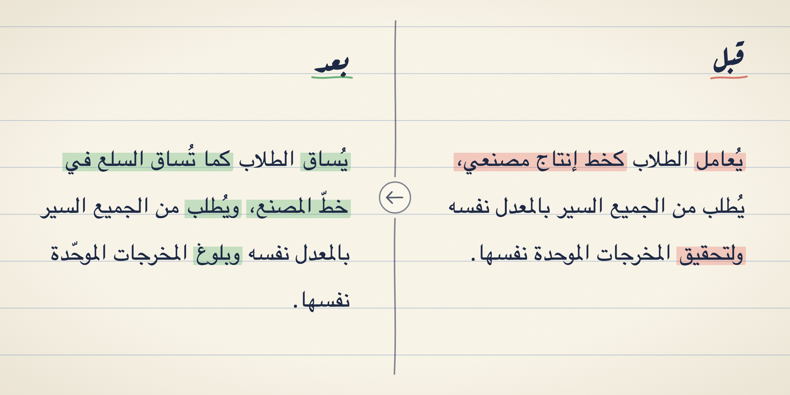

<p align="center">
  
</p>

<h1 align="center">Aranjiyyah · العرنجية</h1>

<p align="center">
  <b>A Claude skill that finds English and French hiding inside Arabic, and rewrites it the way Arabic would say it.</b>
</p>

<p align="center">
  
  
  
  
  
</p>

<div dir="rtl" align="center">

**عربيٌّ في ظاهره، أعجميٌّ في باطنه.**

</div>

---

## What is عرنجية?

**عرنجية** (*Aranjiyyah*, from العربية الفرنجية, "Frankish Arabic") is Arabic that is correct on
the surface and foreign underneath. Every word is Arabic and every case ending
is right, but the sentence frame, the word sense, the collocation or the image
was copied from English or French.

It is everywhere: news, reports, translations, UI copy, academic prose, and
now most text written by language models. Readers stop noticing it because
they meet it constantly, so "it sounds normal" is not evidence that it is
native.

| عرنجي ✗ | عربي ✓ | Copied from |
|---|---|---|
| تمّ إرسال الطلب | أُرسل الطلب | *was sent*, passive with a helper verb |
| يلعب الإعلام دورًا كبيرًا في … | للإعلام أثر كبير في … | *plays a role* |
| من خلال مقاله | بمقاله | *through* for a means |
| الحساب الخاص بك | حسابك | *your own account* |
| أكثر جمالًا | أجمل | *more beautiful* |
| جعله يضحك | أضحكه | *made him laugh* |
| عمل كمعلّم | عمل معلّمًا | *worked as a teacher* |
| حين بلغ النضج | لمّا بلغ أشدّه | *reached maturity* |
| وفقًا للمؤرخين | فيما يذكر المؤرخون | *according to* |

## What the skill does

Give Claude an Arabic text and it will:

1. **Find** calqued constructions, word senses, collocations and styles, using
   201 rules with literal cues to search for.
2. **Judge** each one in context. A cue word is a reason to look closer, not
   proof of a fault, and a long *do not flag* list keeps sound Arabic alone.
3. **Rewrite** from the meaning, fixing the whole frame instead of swapping
   one word for its look-alike (يلعب دورًا → يؤدّي دورًا is still the same
   calque).
4. **Report** findings by severity, each with the rule ID and the printed page
   in the book.

| | Severity | Meaning |
|---|---|---|
| 🔴 | **غيّرها** | A foreign frame or a wrong sense. Change it. |
| 🟡 | **الأحسن تغييرها** | Understandable, but heavy or translated-sounding. |
| 🟢 | — | Fine. Left alone. |

It keeps the register: clear modern فصحى, not archaic and not dialect.

## The rules

| File | Covers | Rules |
|---|---|:---:|
| [`syntax.md`](skills/aranjiyyah/references/syntax.md) | Particles, connectors, tense markers, modal verbs | 34 |
| [`syntax-phrases.md`](skills/aranjiyyah/references/syntax-phrases.md) | إضافة and adjectives, relative clauses, word order, questions | 20 |
| [`morphology.md`](skills/aranjiyyah/references/morphology.md) | Helper words and ‎-ly adverbs where Arabic has a derived form | 14 |
| [`vocabulary.md`](skills/aranjiyyah/references/vocabulary.md) | Nouns used in a foreign sense, loanwords | 35 |
| [`vocabulary-verbs.md`](skills/aranjiyyah/references/vocabulary-verbs.md) | Verbs and adjectives used in a foreign sense | 24 |
| [`vocabulary-dominance.md`](skills/aranjiyyah/references/vocabulary-dominance.md) | Sound words crowding out their native synonyms | 25 |
| [`usage.md`](skills/aranjiyyah/references/usage.md) | Calqued collocations and fixed compounds | 29 |
| [`style.md`](skills/aranjiyyah/references/style.md) | Translated idioms and images, nominal style, stock phrases | 20 |
| [`remedies.md`](skills/aranjiyyah/references/remedies.md) | How to judge borderline cases, tests, rewriting methods, *do not flag* | — |

Each rule looks like this:

```
### STY-001 · يلعب / يؤدّي دورًا
- **العلامة:** يلعب / لعب / أدّى / يؤدّي / يمارس + دورًا؛ يعطيه دورًا
- **الأصل:** play a role / jouer un rôle
- ✗ لعب فلان دورًا مهمًّا في … → ✓ كان لفلان أثر مهمّ في … / أسهم فلان إسهامًا كبيرًا في …
- ✗ أدّى المثقف العربي دورًا تنويريًّا مؤثرًا → ✓ كان للمثقف العربي أثر في تنوير الناس
- **الحكم:** 🔴 مجاز مسرحي منقول؛ و«أدّى» بدل «لعب» تخفي العجمة ولا تزيلها، لأن القالب كله (فعل + دورًا) هو المستعار
- **المصدر:** ص 31، 37، 168، 177
```

## Examples

Two real articles, each next to its rewrite:

| Article | Original | Rewritten |
|---|---|---|
| المدارس: تعليم أم تعليب | [article.md](<sample-articles/المدارس - تعليم أم تعليب/article.md>) | [article-rewritten.md](<sample-articles/المدارس - تعليم أم تعليب/article-rewritten.md>) |
| لماذا يتجه شباب اليوم إلى الزواج المبكر؟ | [article.md](<sample-articles/لماذا يقبل الجيل الصاعد على التبكير في الزواج/article.md>) | [article-rewritten.md](<sample-articles/لماذا يقبل الجيل الصاعد على التبكير في الزواج/article-rewritten.md>) |

## Install

**Any agent** (Claude Code, Cursor, Codex, OpenCode and more), with
[skills.sh](https://skills.sh):

```bash
npx skills add Revxrsal/aranjiyyah
```

**Claude Code plugin**, which lets you pull new rules later with
`claude plugin update aranjiyyah@aranjiyyah`:

```bash
claude plugin marketplace add Revxrsal/aranjiyyah
claude plugin install aranjiyyah@aranjiyyah
```

**Cursor plugin.** The repo is also a Cursor plugin (`.cursor-plugin/`).
Until it appears in Cursor's marketplace, use the `npx skills` command above,
which installs into Cursor too.

**Claude apps.** Download the [`skills/aranjiyyah`](skills/aranjiyyah) folder
as a zip and upload it under Skills in Claude's settings.

## Use

The skill triggers on its own whenever you share Arabic text for review,
editing or translation. You can also ask for it directly:

```text
راجع هذه الفقرة وأخبرني بما فيها من عرنجية: …
```

```text
Rewrite this article so it reads as native Arabic, not translated Arabic.
```

```text
هل «يلعب دورًا» عربية سليمة؟
```

For a single phrase it gives the better form and one line of reasoning. For a
document it lists findings by severity. For a full rewrite it gives the clean
text, then the main changes with their rule IDs.

## How it was built

The rules come from **أحمد الغامدي، «العرنجية: بلسان عربي هجين»**, read page
by page from start to finish.

1. **Collect.** Every page of the book (printed pages 1–217) was read and
   anything that could become a rule was recorded: 561 candidates in all.
2. **Edit.** With the whole book in view, duplicates were merged, related
   candidates generalized into broader patterns, rhetoric that never became a
   concrete rule dropped, and the author's judging criteria turned into rules
   that prevent false positives.
3. **Evaluate.** The finished skill is tested on real Arabic articles and
   revised. The sample articles above are part of this phase.

The rules are distilled in our own words with short example pairs and the
printed page number, not transcribed from the book. To understand the
reasoning behind a rule, go to the cited page.

<details>
<summary><b>Repository layout</b></summary>

```
skills/aranjiyyah/          the skill (SKILL.md + references/)
.claude-plugin/             Claude Code plugin and marketplace manifests
.cursor-plugin/             Cursor plugin manifest
extraction/
  candidates.md             raw output of the collect phase
  decisions.md              rulings that override the book and the model
  log.md                    one line per processed page
  build-report.md           counts and changes from the last build
  state.json                resume point for the page-by-page pass
.claude/skills/
  extract-next/             /extract-next: collect the next pages
  build-skill/              /build-skill: regenerate the references
scripts/page.sh             render one page of your own copy of the book
sample-articles/            real articles and their rewrites
assets/                     README images and the plugin logo
```

</details>

## Credit

All linguistic judgments belong to **أحمد الغامدي** and his book
**«العرنجية: بلسان عربي هجين»**. This repo is a reading aid that points back to
it, not a substitute. If the rules are useful to you, read the book.

<p align="center">
  Made by <b>Ali Al-Kasasbeh</b> · <a href="https://github.com/Revxrsal">@Revxrsal</a>
</p>
